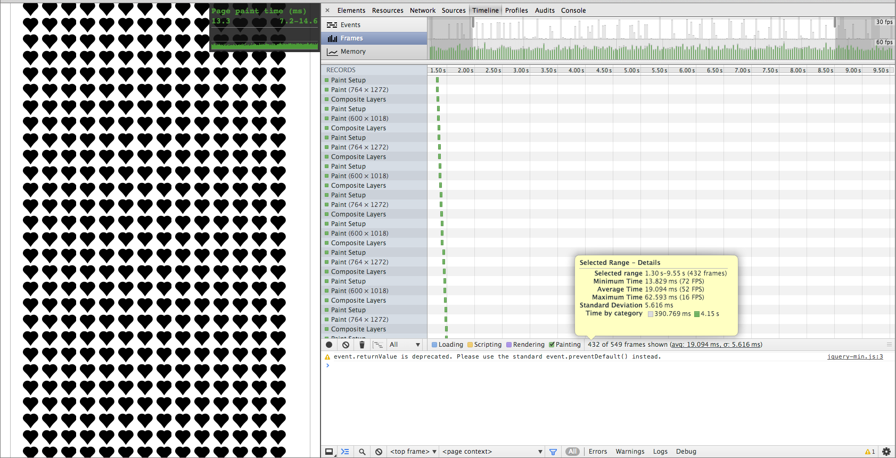
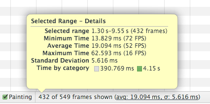
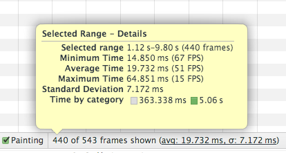
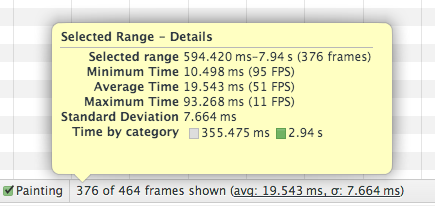
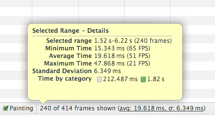
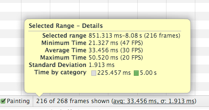
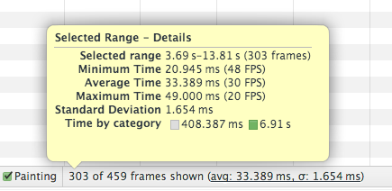
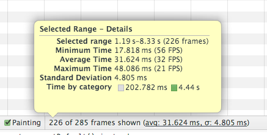
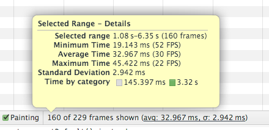
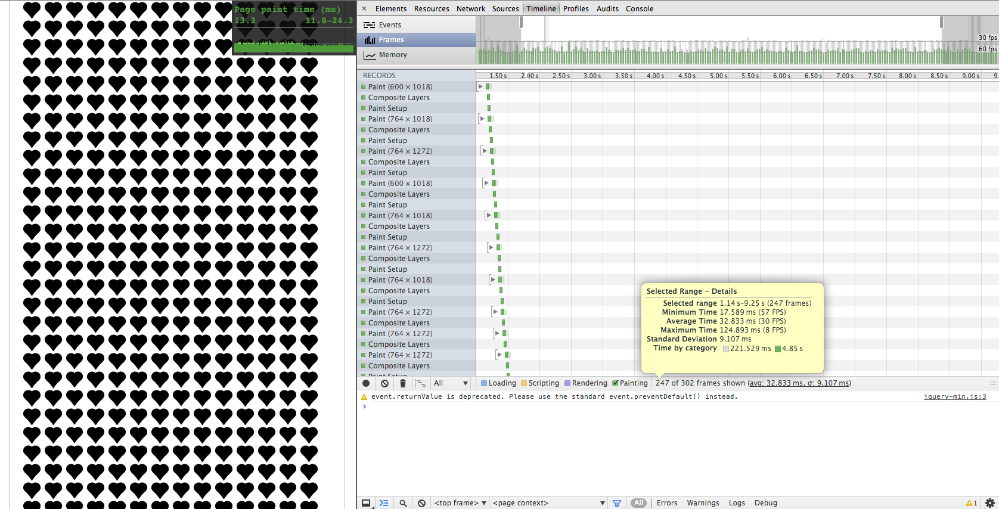

Simple setup to test paint-performance for different ways of including icons.

### Test Setup
Tested the paint performance while scrolling through 10`000 Icons.

#### Versions
- SVG Inline (`<svg>`
- Icon Font (SVG, Woff, TTF)
- SVG Background (`background-image: url('path/to/icon.svg')`)
- SVG Background Data (`background-image: url('data:image/svg+xml;...')`)
- PNG Background (`background-image: url('path/to/icon.png');`)
- PNG Background Data (`background-image: url('data:image/png;...')`)
- WebP Background (`background-image: url('path/to/icon.webp');`)

### Results
I only tested in Chrome for now. So take these results with caution. The results can roughly be summarized as the following:

- Inline SVG and Icon Font rendered at __51FPS__ (~19ms)
- All solutions using `background-image rendered at __30FPS__ (~32ms)

Interestingly the differences between the different file formats are marginal.

The results in detail:
#### Chrome 31.0.1650.63

##### SVG Inline

##### Icon Font (SVG)

##### Icon Font (WOFF)

##### Icon Font (TTF)

##### SVG Background

##### SVG Background Data

##### PNG Background

##### PNG Background Data

##### WebP Background

