Simple setup to test paint-performance for different ways of including icons.

Paint Performance with 1'000 / 10'000 Icons.

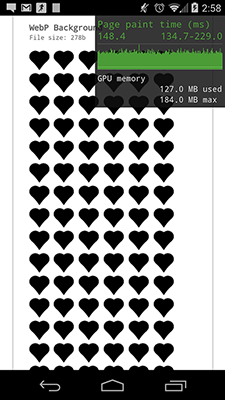

#### Versions
- 1 SVG Inline `<svg>` (used [iconmelon](http://iconmelon.com/))
- 2 Icon Font (SVG, Woff, TTF - used [fontcustom](http://fontcustom.com/))
- 3a SVG Background `background-image: url('path/to/icon.svg')`
- 3b SVG Background Data `background-image: url('data:image/svg+xml;...')`
- 4a PNG Background `background-image: url('path/to/icon.png');`
- 4b PNG Background Data `background-image: url('data:image/png;...')`
- 5 WebP Background `background-image: url('path/to/icon.webp');`

### Results
It's really hard to compare paint-performance in general. (Mostly just visual) For now I only tested in Chrome, as it is the only browser which allows you to track this kind of information.
Still, to get universal results is almost impossible as the performance depends on so many factors. My results can roughly be summarized as the following (take these results with caution):

#### Chrome 32.0.1700.72 beta

Display __10'000__ Icons

- Inline SVG and Icon Font rendered fastest
- PNG, WebP via `background-image` rendered approx. 33% slower
- SVG via `background-image` rendered approx. 100% slower

##### 1 SVG Inline
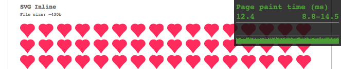

##### 2a Icon Font (SVG)
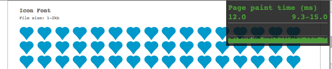

##### 3a SVG Background
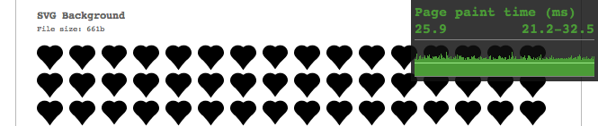

##### 3b SVG Background Data
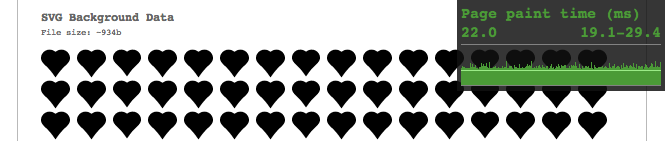

##### 4a PNG Background
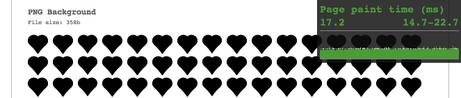

##### 4b PNG Background Data
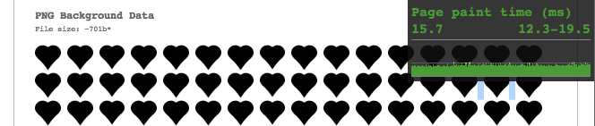

##### 5 WebP Background
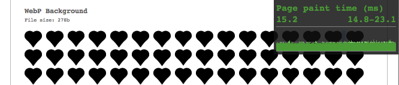

#### Chrome Beta 32.0.1700.94 (Android 4.4.2)

Display __1'000__ Icons

- PNG, WebP via `background-image` rendered fastest
- Inline SVG and Icon Font rendered approx. 50% slower
- SVG via `background-image` rendered approx. 150% slower

##### 1 SVG Inline
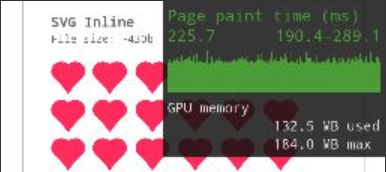

##### 2a Icon Font (SVG)
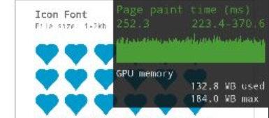

##### 3a SVG Background
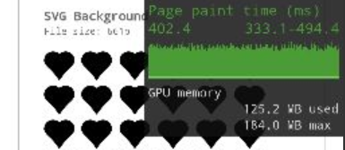

##### 4a PNG Background
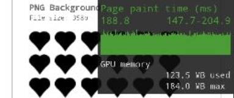

##### 5 WebP Background
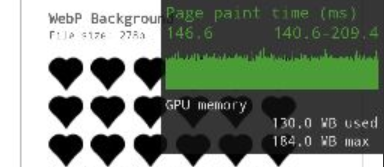
